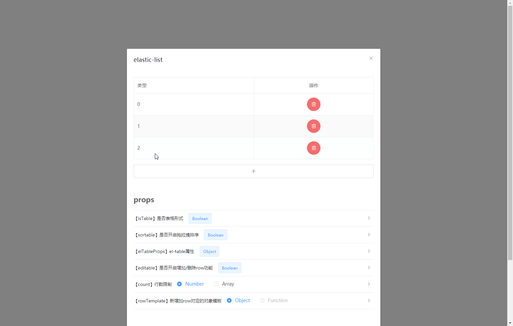

# elastic-list / 弹性列表&动态表格



<br/>

## Features

- √ v-model双绑
- √ 跨组件拖拉拽（如穿梭框场景）
- √ 支持 `el-table`
- √ 支持对象数组（`[{},{}]`）和非对象数组（`[1,2]`）
- √ 对行进行新增、删除、拖拉拽排序
- √ 对行的数量上限、下限进行限制
- √ 自定义新增变量的模板
- √ 全局引入/局部引入 支持全局配置通用参数

`element-ui` 集成说明：

- `element-ui` 是以外置依赖的方式引入的 所以不必担心代码体积和版本不一致等问题
- 集成风格是非侵入式的
    - 支持 `el-table` 的所有参数（且可全局配置）
    - 支持 `el-table` 的所有事件
    - 支持 `el-table` 的所有slot
    - `el-table-column` 以slot形式传入
- 适配 `element-ui` 的 `el-form` 组件 支持 `el-form` 的全局disabled

<br/>

## Installation


``` bash
$ yarn add elastic-list
```

**Dependencies**：vue element-ui?

```js
import ElasticList from 'elastic-list'

// 局部引入
components: { ElasticList }

// 全局引入
Vue.use(ElasticList)
```

<br/>

## Quick Start

**Example for `el-table`**

```html

<ElasticList v-model="value" :elTableProps="{}">
  <el-table-column label="姓名" prop="name"/>
  <el-table-column label="年龄" prop="age"/>
</ElasticList>
```

自定义操作列和添加按钮：

```html

<ElasticList v-model="value">
  <el-table-column label="姓名" prop="name"/>
  <el-table-column label="年龄" prop="age"/>

  <!-- the last column for row operation -->
  <template #operation-column="{showDelBtn,deleteRow}">
    <el-table-column label="操作" align="center">
      <template slot-scope="scope">

        <!-- other buttons -->
        <el-button>其他按钮</el-button>

        <!-- delete button -->
        <el-button
          type="danger"
          circle
          icon="el-icon-delete"
          @click="() => { deleteRow(scope.$index) }"
          v-show="showDelBtn"
        />

      </template>
    </el-table-column>
  </template>

  <!-- row-adding button -->
  <button slot="append-row-btn">增加一行</button>
</ElasticList>
```

<br/>

**Example for lists**

reference-type array:

```html

<el-form :model="form">
  <ElasticList v-model="form.list">
    <template v-slot="{item,i,showDelBtn,deleteRow}">
      <div>

        <!-- delete button -->
        <i
          class="el-icon-circle-close"
          @click="deleteRow(i)"
          v-show="showDelBtn"
        />

        <!-- editable elements -->
        <el-form-item label="名称" :prop="'list.' + i + '.name'">
          <el-input v-model="item.name"/>
        </el-form-item>
        <el-form-item label="排序" :prop="'list.' + i + '.sort'">
          <el-input-number v-model="item.sort"/>
        </el-form-item>

      </div>
    </template>
  </ElasticList>
</el-form>
```

value-type array:

```html

<ElasticList v-model="value">
  <!--
    v-slot解构：
      i: {number} 行号
      item: {any} 数组第i项
      showDelBtn: {boolean} 是否显示删除按钮
      deleteRow: {function} 删除行
  -->
  <template v-slot="{item,i,showDelBtn,deleteRow}">
    <div>

      <!-- row contents -->
      <el-input v-model="value[i]"/>

      <!-- delete button -->
      <i v-show="showDelBtn" class="el-icon-circle-close" @click="deleteRow(i)"/>

    </div>
  </template>

  <!-- row-adding button -->
  <el-button slot="append-row-btn">自定义增加行按钮</el-button>
</ElasticList>
```

transfer among components:

```html

<div>
  <ElasticList
    v-model="value1"
    group="1"
  >
    <template v-slot="{item,i,showDelBtn,deleteRow}">

    </template>
    <div slot="append-row-btn"/>
  </ElasticList>
</div>

<div>
  <ElasticList
    v-model="value2"
    group="1"
  >
    <template v-slot="{item,i,showDelBtn,deleteRow}">
      
    </template>
    <div slot="append-row-btn"/>
  </ElasticList>
</div>
```

<br/>

### props

| Attribute | Description | Configuration Mode | Type | Accepted Values | Default |
| --- | --- | --- | --- | --- | --- |
| v-model / value | 双绑 | props | array | | |
| elTableProps | el-table配置 | global，props | object | *see below* | |
| sortable | 是否开启拖拉拽排序 | global，props | boolean | | true |
| disabled | 禁用模式下无法新增、删除、排序 | global，props | boolean | | false |
| count | 行数限制 | global，props | number, array | *see below* | |
| rowTemplate | 新增row对应的模板 | global，props | object, function | *see below* | {} / '' |
| ... | sortablejs配置 | global，props | | *see below* | |

<br/>

**elTableProps**

默认值：

```
{
  border: true,
  fit: true,
  stripe: true,
  highlightCurrentRow: true,
}
```

配置方式：与默认值进行混入 [el-table文档](https://element.eleme.cn/#/zh-CN/component/table)

<br/>

**sortablejs配置**

默认值：

```
{
  filter: 'input,.el-rate',
  preventOnFilter: false,
  animation: 500,
}
```

配置方式：与默认值进行混入 [sortablejs文档](https://github.com/SortableJS/sortablejs)

<br/>

**count**

比如你想限制不能超过5行：

```js
Vue.use(ElasticList, {
  count: 5
})
```

如果你还想限制不能低于2行：

```js
Vue.use(ElasticList, {
  count: [2, 5]
})
```

<br/>

**rowTemplate**

> 如果value[0]的类型是string 则默认值为'' 否则为{}

> 可以手动指定 支持Function Function的返回值将作为新增项

```js
Vue.use(ElasticList, {
  rowTemplate (i) {
    return i // i是新增的这一行的序号
  }
})
```

<br/>

### slots

| name | Description |
| --- | --- |
| append-row-btn | 增加行的触发按钮 |
| operation-column | el-table最后一列（用于删除行等操作） |
| placeholder | value为空时的占位符 |
| ... | el-table所有slot |

<br/>

### events

- 支持 `sortablejs` 所有事件
- 支持 `el-table` 所有事件

```html

<ElasticList
  @select="onSelect"
  @sort="onSort"
>
</ElasticList>
```

<br/>

### 拖动触发范围

默认是整行均可以拖动 如果你想要指定触发元素：

```html

<ElasticList v-model="value" handle=".handle">
  <el-table-column type="index">
    <template slot-scope="scope">
      <span class="handle">
        {{ '# ' + (scope.$index + 1) }}
      </span>
    </template>
  </el-table-column>
  <el-table-column label="姓名" prop="name"/>
</ElasticList>
```

> 由于在输入框内拖动时 用户的用意往往是选中输入内容而不是拖动排序 所以默认在输入框内不触发排序（可配置）

<br/>

### value监听

组件内不会监听非对象数组类型的value的后续变化 如果value在初始化后需要修改 可使用以下方式：

::: tip  
为什么？

- 如果数组元素被绑定到输入框之类的可以在界面上直接编辑的地方 每次输入都会触发重绘 导致无法连续输入
  :::

```vue

<template>
  <div>
    <ElasticList
      ref="elasticList"
    >
    </ElasticList>
  </div>
</template>

<script>
export default {
  created () {
    this.POST().then(res => {
      this.$refs.elasticList.setValue(res.data)
    })
  },
}
</script>
```

或者

```vue

<template>
  <div>
    <ElasticList
      v-model="value"
      v-if="loading"
    >
    </ElasticList>
  </div>
</template>

<script>
export default {
  data () {
    return {
      value: [],
      loading: true
    }
  },
  created () {
    this.POST()
    .then(res => {
      this.value = res.data
    })
    .finally(() => {
      this.loading = false
    })
  },
}
</script>
```
