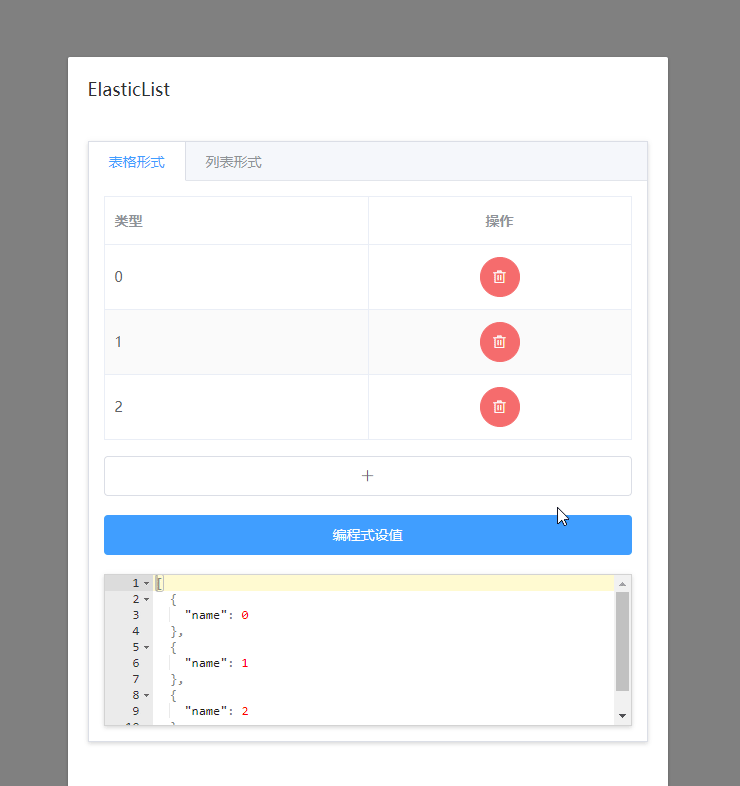

# elastic-list / 弹性列表&动态表格



<br/>

### Features

- √ v-model双绑
- √ 表格展示、列表展示两种展示方式
- √ 数组的元素类型不局限于对象（[{},{}]） 同样支持值类型变量（[1,2]）
- √ 自定义列表 slot传入
- √ 对行进行新增、删除、拖拉拽排序
- √ 对行的数量上限、下限进行限制
- √ 自定义新增变量的模板
- √ 全局安装/单独引入 通用参数支持全局配置

element-ui集成说明：

- element-ui是以外置依赖的方式引入的 所以不必担心代码体积和版本不一致等问题
- 集成风格是非侵入式的 支持el-table的所有参数（且可全局配置） el-table-column则是以slot形式传入
- 适配element-ui的el-form组件 支持el-form的全局disabled

<br/>

### Installation

``` bash
$ yarn add elastic-list
```

**Dependencies**：vue element-ui

<br/>

```js
import { ElasticList } from 'elastic-list'
components: { ElasticList }
```

**Globally:**
```js
import ElasticList from 'elastic-list'
Vue.use(ElasticList)
```

<br/>

### Quick Start

表格形式：

```html
<ElasticList v-model="value" :elTableProps="{}">
  <el-table-column label="姓名" prop="name"/>
  <el-table-column label="年龄" prop="age"/>
</ElasticList>
```

自定义操作列和添加按钮：

```html
<ElasticList v-model="value">
  <el-table-column label="姓名" prop="name"/>
  <el-table-column label="年龄" prop="age"/>

  <!--自定义末尾的操作列-->
  <template #operation-column="{showDelBtn,deleteRow}">
    <el-table-column label="操作" align="center">
      <template slot-scope="scope">
        <el-button>其他按钮</el-button>
        <el-button 
          type="danger"
          circle
          icon="el-icon-delete"
          @click="()=>{deleteRow(scope.$index)}"
          v-show="showDelBtn"
        />
      </template>
    </el-table-column>
  </template>

  <!--自定义增加行按钮-->
  <button slot="append-row-btn">增加一行</button>
</ElasticList>
```

列表形式：

```html
<ElasticList v-model="value">
  <!--
    v-slot解构：
      i: {number} 行号
      v: {any} 数组第i项
      showDelBtn: {boolean} 是否显示删除按钮
      deleteRow: {function} 删除行
  -->
  <template v-slot="{v,i,showDelBtn,deleteRow}">
    <!--自定义行元素-->
    <div class="row">
      <el-input v-model="value[i]"/>
      <!--自定义删除按钮-->
      <i v-show="showDelBtn" class="el-icon-circle-close" @click="deleteRow(i)"/>
    </div>
  </template>

  <!--自定义增加行按钮-->
  <el-button slot="append-row-btn">自定义增加行按钮</el-button>
</ElasticList>
```

<br/>

props: 

| Attribute | Description | Configuration Mode | Type | Accepted Values | Default |
| --- | --- | --- | --- | --- | --- |
| v-model / value | 双绑 | props | array | | |
| elTableProps | el-table属性 | global，props | object | *see below* | |
| sortable | 是否开启拖拉拽排序 | global，props | boolean | | true |
| disabled | 禁用模式下无法新增、删除、排序 | global，props | boolean | | false |
| count | 行数限制 | global，props | number, array | *see below* | |
| rowTemplate | 新增加row对应的模板 | global，props | object, function | *see below* | {} / '' |
| watchValue | 是否监听value的变化 | global，props | boolean | *see below* | true |
| animate | 添加行时的动画名称（列表形式） | global，props | string | https://animate.style （不需要动画请传空字符串） | 'zoomIn' |

<br/>

elTableProps:

默认值：

```
{
  border: true,
  fit: true,
  stripe: true,
  highlightCurrentRow: true,
}
```

配置方式：与默认值进行混入 [el-table文档](https://element.eleme.cn/#/zh-CN/component/table)

<br/>

count:

比如你想限制不能超过5行：

```js
Vue.use(ElasticList, {
  count: 5              
})
```

如果你还想限制不能低于2行：

```js
Vue.use(ElasticList, {
  count: [2, 5]              
})
```

<br/>

rowTemplate:

> 如果value[0]的类型是json对象 则默认值为{} 否则为''

> 可以手动指定 支持Function Function的返回值将作为新增项

```js
Vue.use(ElasticList, {
  rowTemplate(i) {
    return i // i是新增的这一行的序号
  }              
})
```

<br/>

watchValue:

因为除了手动的增减、排序会改变value以外 value还有被编码式设值的情况 如没有可以将watchValue设为false以提升性能

有一种情况必须取消监听：当value为值类型数组且数组元素被绑定到输入框之类的可以在界面上直接编辑的地方 此时每次输入都会触发重绘 导致无法连续输入

取消对value的监听后 如果你的value是异步获取的 在获取到数据后再加载组件：

```html
<ElasticList v-if="!loading" :watchValue="false"/>
```

```js
axios.post().finally(() => { this.loading = false })
```
